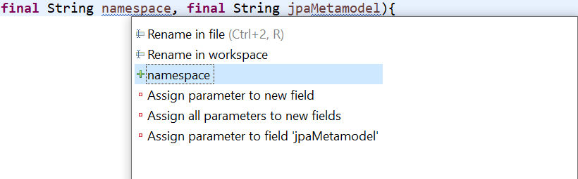

= Spell check plug-in for eclipse

This plug-in supports spell check for Java elements like classes, interfaces, method or local variables. A token is split into 
In case an error is detected, a word was not found in the directory, proposals are generated with a https://en.wikipedia.org/wiki/Damerau–Levenshtein_distance[Damerau–Levenshtein Distance]
of one. 

Ctrl + 1

2 errors 

Two options to correct 

Preferences

The check respects 

Not all occurrences are marked 

[NOTE]
====
An admonition block may contain complex content.

====

Rename
Add to a specific directory