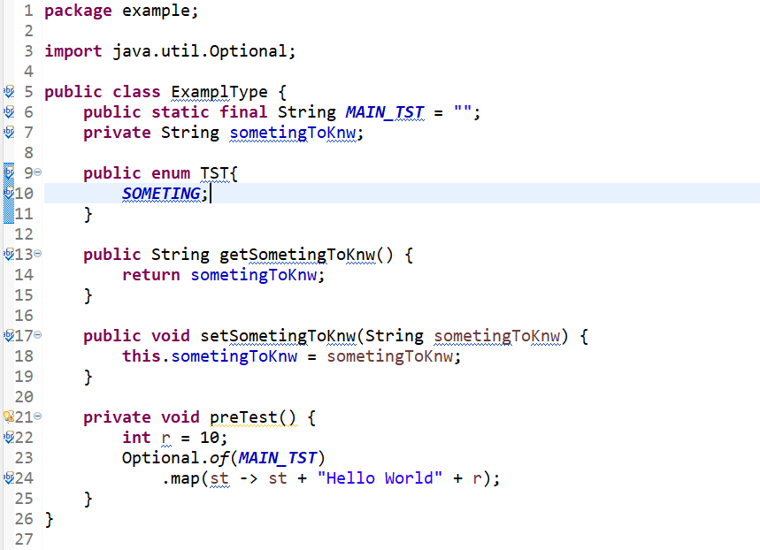
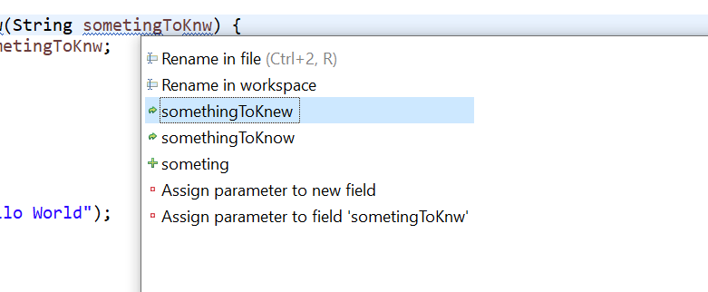
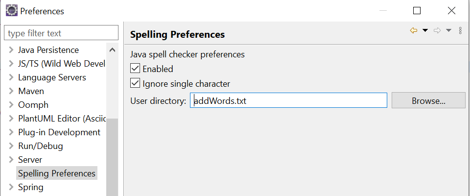

= Spell check plug-in for eclipse

This plug-in supports spell check for the names of Java artifacts like classes, interfaces, method or local variables. 
The names are split into fragments, either at non-letters or at a switch from lower to upper case. E.g. _somethingInteresting_ 
into _something_ and _Interesting_ or _WITH_UNDERSCORE_ into _WITH_ and _UNDERSCORE_. Only English letters (from ASCII 7) are supported.

In case an error is detected, the corresponding part is marked:

On pressing _Ctrl + 1_ (quick fix), two options to correct a problem are provided. On the one hand, a fragment can be added
to a specific directory. On the other hand proposals are generated with a https://en.wikipedia.org/wiki/Damerau–Levenshtein_distance[Damerau–Levenshtein Distance]
of one, which can be used to rename the artifact. In case more than two fragments have an error, the proposals provide a fix for only one of them. 

It is possible to activate or deactivate the plug-in, ignore single characters and provide an own directory.

[NOTE]
====
Spell errors of local variable definitions within lambda expressions may raise an error when trying to rename the local variable.

====
